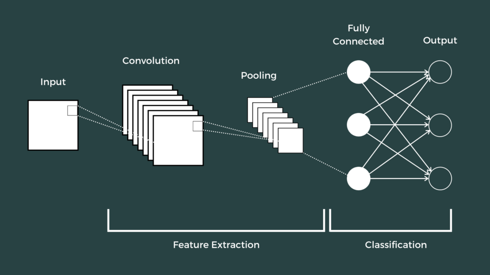
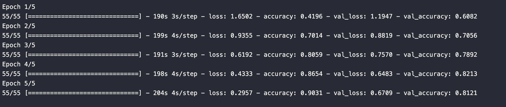
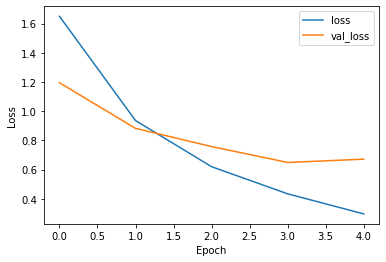

# Urban Sounds Classification Project with Deep Learning 

Deep Learning; It is one of the first technologies to be applied in subjects such as data, image processing and sound classification. In this project, deep learning was used to train recorded audio data in a city.

This project used the “UrbanSounds8K” dataset to classify the sounds heard in cities. The aim of this project is to prepare an artificial intelligence model using deep learning algorithms. This dataset contains 8732 labeled sound excerpts of urban sounds from 10 classes.

## Resources

Dataset resource;
https://urbansounddataset.weebly.com/urbansound8k.html

This is the source where I used the preprocessed spectrograms;
https://drive.google.com/drive/folders/1xey3vAVNDjWxnSfhuUsf_5dGANZWmCog

## Steps

### Preprocessing
In this step, the data we obtained from the UrbanSound8K.csv file was made ready by matching the '.wav' audio data in the audio folder.

Spectrogram normalization:
Each audio spectrogram was converted into numerical data.
It is set to grayscale.
Reshaped.
These are our X. So, our features.

Our Labels, 'class', are taken from our metadata DataFrame as Y.
Now we have X and Y.

Our data is set to be 80% Train, 10% Validation, 10% Test.

### Model Preparation and Training
In this project, we are using Convolutional Neural Networks, CNN, for deep learning. So, we need to build a CNN architecture. Our architecture is as follows:

Detailed features of the established neural network:

Model Architecture:
Convolutional Layer -> Max Pooling Layer -> Convolutional Layer ->  Flatten -> Dense Layer -> Dense Layer -> Output Layer

* Activation Function: ReLU
* Optimizer : Adam
* Loss: Sparse Categorical Crossentropy
* Output Activation: Softmax
* Fitting : batch_size=128,
                  epochs=5

### Results and Loss & Accuracy Tracking

* Accuracy Rate: %81.21

* Loss - Validations Loss

* Accuracy - Validations Accuracy

***

created by esradasdan
